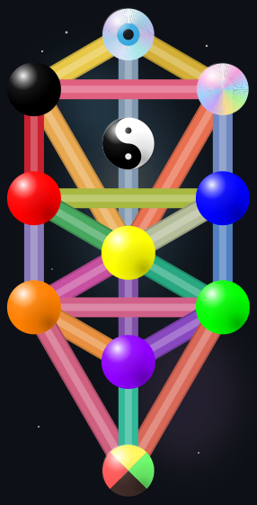

# Kaabalah

A comprehensive TypeScript library for numerology, astrology, kaabalah, gematria, tarot, and Ifa divination.

<p align="center">
  
</p>

## Documentation

Full API reference, guides, and examples: **[docs.kaabalah.com](https://docs.kaabalah.com/)**

## Installation

```bash
npm install kaabalah
```

Node.js 18.18+ required.

## Modules

All modules are tree-shakable and can be imported independently:

| Module | Import | Description |
|--------|--------|-------------|
| Core | `kaabalah/core` | Tree of Life graph with cross-system correspondences |
| Numerology | `kaabalah/numerology` | Life path, cycles, challenges, personal year |
| Astrology | `kaabalah/astrology` | Birth charts, synastry, composite, transits, solar returns, profections, firdaria, astrocartography, dignity, decans, dodecatemoria |
| Gematria | `kaabalah/gematria` | Hebrew letter numerology |
| Tarot | `kaabalah/tarot` | 78-card deck with profiles, archetypes, correspondences, multi-deck images, spread engine |
| Ifa | `kaabalah/ifa` | Odu divination |
| Semantic | `kaabalah/semantic` | Theme profiles, kaabalistic overlay correspondences, symbol metadata |
| Visual | `kaabalah/visual` | Tree of Life and astrology wheel SVG generation plus layout/render-model data |

## Quick Example

```typescript
import { createTree, id, KaabalahTypes } from 'kaabalah/core';
import { getBirthChart } from 'kaabalah/astrology';
import { calculateKaabalisticLifePath } from 'kaabalah/numerology';
import { getTarotCorrespondenceProfile } from 'kaabalah/tarot';
import { generateAstroWheelSvg, generateTreeSvg } from 'kaabalah/visual';

const tree = createTree({ system: 'kaabalah', parts: ['westernAstrology', 'tarot'] });
const correspondences = tree.getCorrespondences(id(KaabalahTypes.SPHERE, 'Tiphareth'), { depth: 2 });

const chart = await getBirthChart({
  date: { year: 1990, month: 6, day: 15, hour: 14, minute: 30 },
  latitude: 48.856, longitude: 2.352,
});

const lifePath = calculateKaabalisticLifePath(new Date('1990-06-15'));
const magician = getTarotCorrespondenceProfile({ tarotCardName: 'The Magician' });
const svg = generateTreeSvg({ background: 'transparent', palette: 'monochrome' });
const wheelSvg = generateAstroWheelSvg(chart, { background: 'transparent' });
```

## CLI

```bash
npx kaabalah help                    # list all commands
npx kaabalah help --json             # full schema introspection
npx kaabalah numerology 1990-01-15 --json --compact
npx kaabalah astrology 1990-01-15 14:30 --lat=40.71 --lon=-74 --json
npx kaabalah astrology:wheel 1990-01-15 14:30 --lat=40.71 --lon=-74 --json --compact --fields=svg
npx kaabalah tree:node "tarotArkAnnu:The Magician" --depth=2 --json
```

28 commands covering all modules. See the [CLI Reference](https://docs.kaabalah.com/getting-started/cli/) for the full list.

## Support

[](https://ko-fi.com/matmoura19)

## License

AGPL-3.0 — see [LICENSE](LICENSE).

## Acknowledgments

- [Swiss Ephemeris](https://www.astro.com/swisseph/) for astronomical calculations
- [Astro.com](https://www.astro.com/) for ephemeris data
